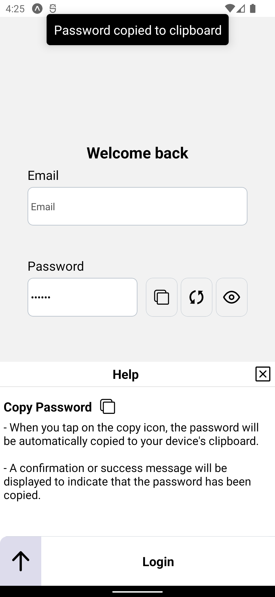

# Review my react native portfolio application v0.9

</a>

- download Expo Go application https://expo.dev/client

- Scan QR

</a>

- or open this link : **[Preview](https://expo.dev/preview/update?message=expo51&updateRuntimeVersion=exposdk%3A51.0.0&createdAt=2024-07-24T22%3A15%3A33.148Z&slug=exp&projectId=b89f6c6b-eacd-4624-bc60-d11d3b0f12f3&group=906c1ce4-cafa-494f-bbe9-fcdef9f5c8d9)**

# Application in [Trello](https://trello.com/b/LCgVV444/portfolio)

# Application in 

# [ Backend ](https://github.com/AHMED-5G/portfolio-backend)

# Need Contributors

## contribute in this application as :

- User Experience Developer.
- User Interface Developer.
- User Experience Writer.
- Graphic Designer.

 

AHMED_5G@YAHOO.COM

# Rood map - [Releases](https://github.com/AHMED-5G/portfolio/releases)

Improve UI and UX and test all app in all stages

## V 0.9 "Connected" -- released

Details

- Connect to the real backend server
- Implement login/signup with email
- Implement reset password functionality
- Set up the [backup feature](https://twitter.com/AD_5G/status/1692062142491484294)
- Fix bugs and improve the theme
- Set up the [shared data](https://github.com/AHMED-5G/portfolio-shared-data) submodule

## V 0.8 "About Me" -- released

Details

- Set up a responsive layout
- Upgrade to Expo 49
- Add the [flat list with indicator library](https://github.com/AHMED-5G/react-native-flatlist-withindicator)
- Display contributors details
- Add my details
- Implement the [roll on scroll animation](https://twitter.com/AD_5G/status/1689796009587605504)
- Set up ESLint
- Add a custom font

## V 0.7 "The Night" -- released

Details

- Add dark theme
- Improve the theme
- Fix bugs

## V 0.6 "From Right To Left" -- released

Details

- Implement localization, running the application in Arabic and supporting RTL systems
- Improve accessibility
- Add skeleton placeholders in the home screen
- Disable the search for products feature due to issues
- Roll on scroll animation
- Set up ESLint
- Add a custom font

## V 0.5 "Add To Cart" -- released

Details

- Implement the market section using Redux Toolkit, with search for products and a custom bottom bar
- "Add to cart" card with interactions, different input methods, image view, and calculations
- Improve the yacht screen animations and add a custom bottom bar

## V 0.4 "Yacht" -- released

Details

- Add the yacht section with a custom image viewer
- Improve the design theme with primary, secondary, and action colors
- Hide the horses section for now
- Redesign the home cards for hotels and contributors

## V 0.3 "SWITCH" -- released

- Repeat v 0.1
- Add multi-language support

  
Details

- Upgraded bottom tab with dynamic open and close, additional drawer features
- Settings tab with multi-language option and reading theme options
- Horses section added to the Home screen with shared element feature, 3 switchable modals for browsing content, and more
- Add skeleton animations for posts while downloading, resize some icons to improve UI/UX, fix bugs, and improve accessibility
- Follow user functionality that will follow you back

## V 0.2 "PULL TO REFRESH" -- released

- Repeat v 0.1
- Improve accessibility

  
Details

- Feeds tab added with text, image, and video posts
- Implement pull to refresh feature
- Scroll to top when tab is in the feeds tab
- Stop the video when scrolling away
- Improve user experience with micro interactions (animations, sounds, and alert messages)
- Improve accessibility tested by Google Accessibility Scanner and Android Talkback
- Follow user functionality that will follow you back

## V 0.1 "FIND THE PARTNERS" -- released

- Create a main bottom tab like Home, Notification, Profile, Cart, or Posts, or more
- Create details screen with features like animations, image slider, payment simulation, chat

Released with the following features:

  
Details

