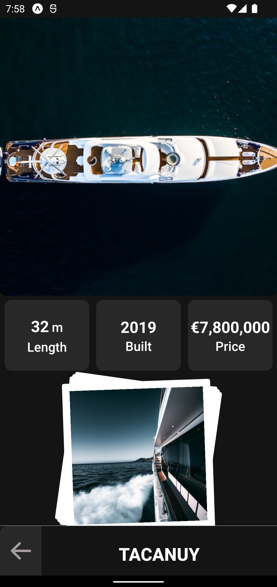

# Review my react native portfolio application v0.8

</a>

- For android devices download Expo Go application https://expo.dev/client

- For IOS devices maybe later .

- Scan QR

</a>

- or past link:

  exp://u.expo.dev/update/086e8b61-8371-46d5-a7cb-dda0edb16b61

# Application in [Trello](https://trello.com/b/LCgVV444/portfolio)

# Application in 

# Need Contributors

## contribute in this application as :

- User Experience Developer.
- User Interface Developer.
- User Experience Writer.
- Graphic Designer.

 

AHMED_5G@YAHOO.COM

# Rood map - [Releases](https://github.com/AHMED-5G/portfolio/releases)

Improve UI and UX and test all app in all stages

## V 0.8 "About Me" -- released

Details

- Set up responsive layout
- Upgrade to Expo 49
- Add [flat list with indicator library](https://github.com/AHMED-5G/react-native-flatlist-withindicator)
- Contributors details
- Add my details
- [Roll on scroll animation](https://twitter.com/AD_5G/status/1689796009587605504)
- Setup ESLint
- Add custom font
  

## V 0.7 "The Night" -- released

Details

- Add dark theme
- Improve theme
- Fix bugs
  

## V 0.6 "From Right To Left" -- released

Details

- Improve Localization, application running in arabic and From Right To left with RTL systems.

- Improve accessability.

- Add skeleton placeholders in home screen .

- Search for products feature disabled contains some issues,

  

## V 0.5 "Add To Cart" -- released

Details

- Market section managed by redux toolkit with search for products and custom bottom bar.

- "Add to cart" card contain interactions, different inputs methods, image view and calculations.

- improve yacht screen animations and add custom bottom bar.

  

## V 0.4 "Yacht" -- released

Details

- add yacht section with custom image viewer.

- add design theme primary, secondary, and action color ... .

- hide horses section for now .

- redesign home cards Hotels card and Contributors card.
  

## V 0.3 "SWITCH" -- released

- repeat v 0.1

- add multi language.

  
Details

- upgraded bottom tab add dynamic open and close, add more drawer features in.

- settings Tab has added contains:

  - multi language option.
  - reading theme options so user can save his reading theme to use it in app.

- Horses Section has added to Home screen contains:

  - shared element feature.
  - 3 switchable modals to improve browsing all Item content in one screen instead of use many.

- add skeleton animations to posts while download , resize some icons improve UI / UX, fix bugs and improve accessability .
  

## V 0.2 "PULL TO REFRESH" -- released

- repeat v 0.1.

- add accessibility.

  
Details

  
- feeds tab added , text , image and videos posts.

- pull to refresh feature.

- scroll to top when tab in feed tab.

- video stop when scroll away .

- user experience improved by add micro interactions : animations, sounds and alert messages ...

- accessibility improved and tested by google accessibility scanner application and android talkback .

- follow user and he will follow you back .
  

## V 0.1 "FIND THE PARTNERS" -- released

- Create 1 main bottom Tab like Home, Notification, Profile, Cart, or Posts , ...

- Create details screen with some features like :Animations, Image slide ,Payment simulation, Chat.

Released and have this features :

  
Details

- Home Screen with 2 sections
- Hotel details screen contains :
  - Images Slider automated with mini images
  - booking button with loading indicator and 2 flash messages for both senarios .
  

